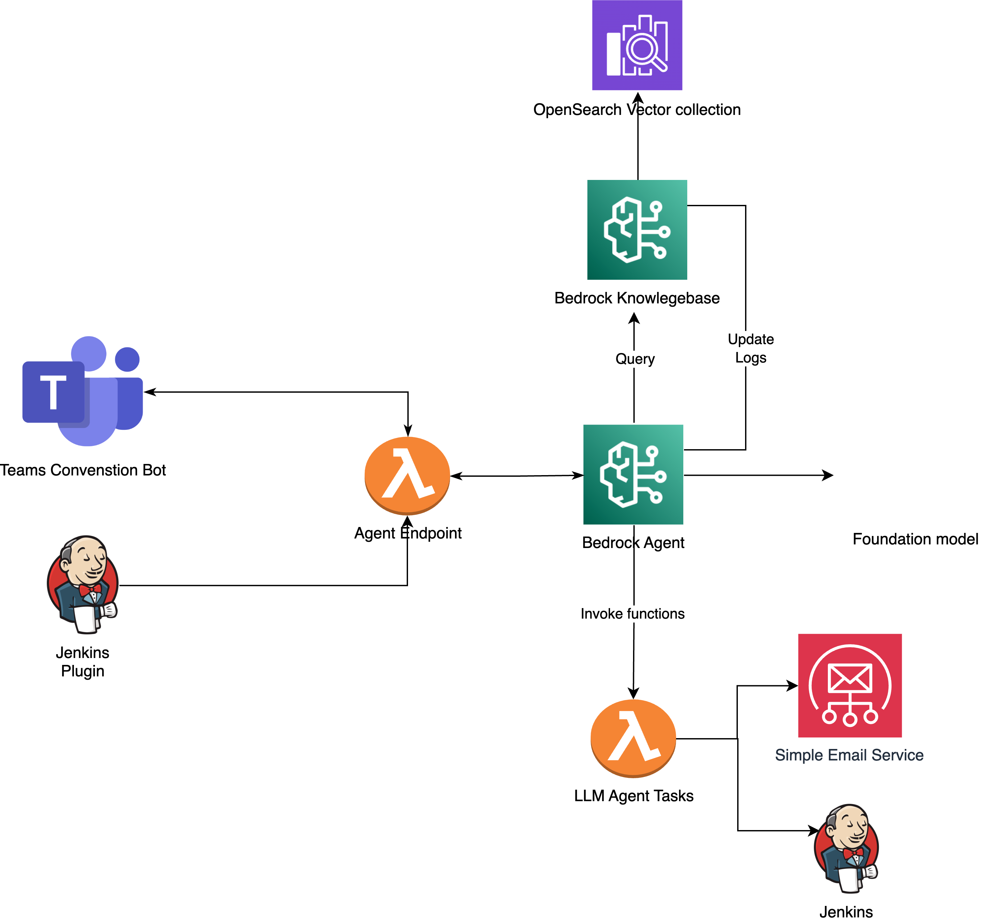

# Global-e Jenkins LLM Build Analytics

This repository contains modules and tools designed to integrate and enhance the functionality of Jenkins with AI/LLM-based analytics and automation. Below is a description of each module in the project.

## Architecture

The architecture integrates Jenkins with AI-driven analytics and automation using AWS services. Below is the system architecture diagram:

### Key Components
- **Jenkins:** Core CI/CD tool for building and testing pipelines.
- **AWS Lambda:** Executes serverless functions for tasks like failure analysis and notifications.
- **Amazon Bedrock:** Provides the LLM for querying logs and generating insights.
- **Microsoft Teams:** Enables chatbot-based interactions for notifications and operations.
- **Amazon SES:** Sends email notifications for pipeline events and failures.

## Modules

### 1. `bedrock_agent_evaluation`
This module is responsible for evaluating and fine-tuning the Amazon Bedrock agent to ensure optimal performance. The evaluation focuses on tasks such as:
- Accuracy and relevance of recommendations.
- Execution of tasks based on Jenkins pipeline failures.
- Logging and performance metrics collection for analysis.

### 2. `bedrock_agent_kb`
The knowledge base (KB) module serves as the repository for internal Jenkins documentation, logs, and best practices. It provides the context needed for:
- LLM operations.
- Generating insights and recommendations.
- Supporting the Bedrock agent in analyzing Jenkins logs.

### 3. `jenkins_build_failure_plugin`
This plugin is designed to analyze build failures in Jenkins. It includes:
- Integration with Jenkins to capture build failure details.
- Use of LLM to suggest root cause analysis and potential fixes.
- Generation of reports for SRE/DevOps teams.

### 4. `llm_chat_lambda`
This AWS Lambda function enables chat-based interactions with the LLM. It provides:
- A conversational interface for querying Jenkins pipeline information.
- Ability to retrieve and operate on Jenkins data.
- Integration with the Bedrock agent for enhanced responses.

### 5. `teams_jenkins_bot`
This module provides a Microsoft Teams bot for Jenkins. The bot allows:
- Notifications about pipeline status and failures.
- Real-time communication with the Bedrock-powered LLM.
- Triggering Jenkins jobs and workflows directly from Teams.

## How to Use
1. **Setup:** Clone the repository and set up the `.venv` virtual environment.
2. **Configuration:** Configure each module by updating relevant environment variables and settings.
3. **Deployment:** Deploy the modules to your Jenkins environment, Teams, or AWS as required.

## Prerequisites
- Python 3.x
- AWS credentials with appropriate permissions.
- Jenkins instance with relevant plugins.
- Microsoft Teams account for bot integration.

